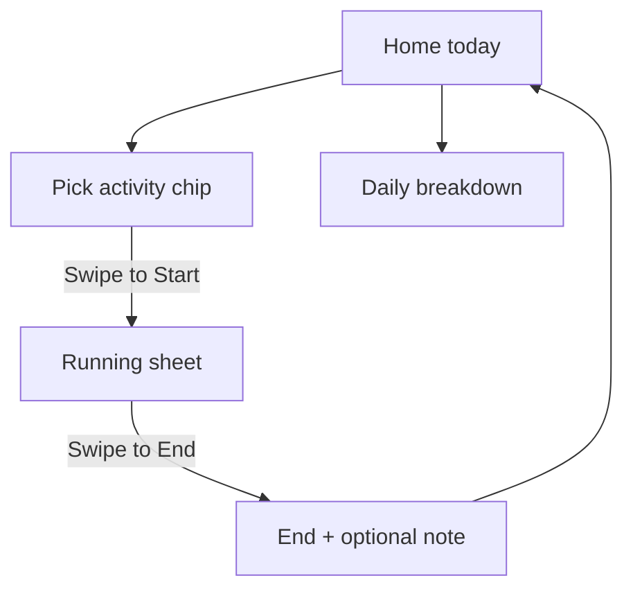

# MyDayInLog MVP

## Product

**One purpose:** when you start a timer, you are declaring what this block of time is for (Lesson, Revision, Jogging, etc.). Ending it records the truth. A daily summary shows where the hours went so doomscrolling is visible as *unlogged / not intentional*, and intentional blocks stay honest.

Not in scope for v1: mentor/mentee, EXP/gems, prize path, GPS proof, task catalogs, community.

**Default day boundary:** calendar day in the user’s local timezone (store UTC timestamps; bucket by local date for the summary).

## Project setup (chosen approach)

Create a **new folder/repo** next to Milestone (e.g. `Desktop/MyDayInLog`), scaffold a fresh Next.js 16 + TypeScript + Tailwind app, own Supabase project (or a separate schema), deploy separately.

**Reuse by reference, not by fork:**


| Borrow from Milestone                                        | Do not carry over                                |
| ------------------------------------------------------------ | ------------------------------------------------ |
| Passcode self-register (Solo-style)                          | Mentor/mentee, invites, family sync              |
| `[SwipeToEnter](src/components/ui/SwipeToEnter.tsx)` pattern | Environmental check / GPS                        |
| Bottom sheet timer start/end + monotonic clock               | Tasks, gems, prize path, shop                    |
| Cozy mobile shell (~475px)                                   | Catalog templates, blob avatars (optional later) |


In Cursor: open **MyDayInLog** as the workspace; mention Milestone path as *reference only* when implementing swipe/timer/auth.

## Auth

Same idea as Solo Challenge:

- Arrival: enter 5-char code **or** “Start MyDayInLog” → generate unused code → swipe to signup
- Code → `{code}@mvp.local` + password = code (Supabase email auth, confirm email off)
- Nickname once on setup; show “save your passcode” screen once
- No linked accounts

## Shared supabase database with Milestone Project

As there are limited projects allocated to free supabase account, I would like both Milestone and MyDayInLog to share the same project. as user auth is similar, you may just treat them equally but have user in separate databse tables to identify. 

## Data model (minimal)

```sql
profiles (id, invitation_code, nickname, created_at)
activity_types (id, user_id, name, color, sort, archived)
time_blocks (
  id, user_id, activity_type_id,
  started_at, ended_at, duration_seconds,
  note  -- optional short label, like solo session_note
)
-- at most one open block per user (ended_at IS NULL)
```

**Seed activity types** on first signup: Lesson, Revision, Running/Jogging, Break, Other. User can rename/add/archive later (simple list on Profile).

## Core UX (single home screen)




1. **Today header** — date + total logged minutes
2. **Daily summary** — stacked bar or simple list: share of day per activity (hours + %). Unlogged remainder of waking window is **not** invented; show only *logged* time and a clear “Logged Xh today” total
3. **Activity chips** — horizontal list; select one before start
4. **Bottom sheet** — idle: “Swipe to Start {Activity}”; running: live clock + activity name; end: duration + optional note bubbles (reuse solo note idea) + “Swipe to Save”
5. **One active timer** — starting another while one runs is blocked (or auto-end previous — **block and prompt** in v1)

No GPS. No EXP. Pure duration honesty.

## Encouragement / anti-doomscroll framing (copy only)

- Idle sheet copy: focus on *naming* the next block (“What are you doing now?”)
- Running sheet: activity name large; no social features
- If duration is very short (< 1 min), still allow save (honest micro-blocks); no fake rewards

## Stack & files (target shape)

```
mydayinlog/
  src/app/(auth)/login|setup|remember-code
  src/app/(app)/page.tsx          # home: summary + chips + timer
  src/app/(app)/profile/page.tsx  # passcode + edit activity types
  src/app/api/auth|blocks|activities|profile
  src/components/timer/DayTimer.tsx
  src/components/summary/DailyBreakdown.tsx
  src/lib/auth.ts, scoring-time.ts, supabase/*
```

APIs: `POST /api/blocks` start|end; `GET /api/blocks?date=YYYY-MM-DD`; CRUD activities for the signed-in user.

## Implementation order

1. Scaffold app + Supabase clients + passcode auth (copy Solo flow patterns)
2. Activity types seed + chips UI
3. Start/end time blocks + one-open-session rule
4. Daily summary from today’s blocks
5. Optional note on end + recent-note bubbles
6. Profile: passcode + manage activity types
7. Deploy (Vercel) + polish mobile sheet

## Explicitly out of v1

- Weekly charts, streaks, social sharing
- Auto-detect doomscrolling / phone usage APIs
- Pomodoro auto-breaks
- Milestone dual accounts or gem economy

